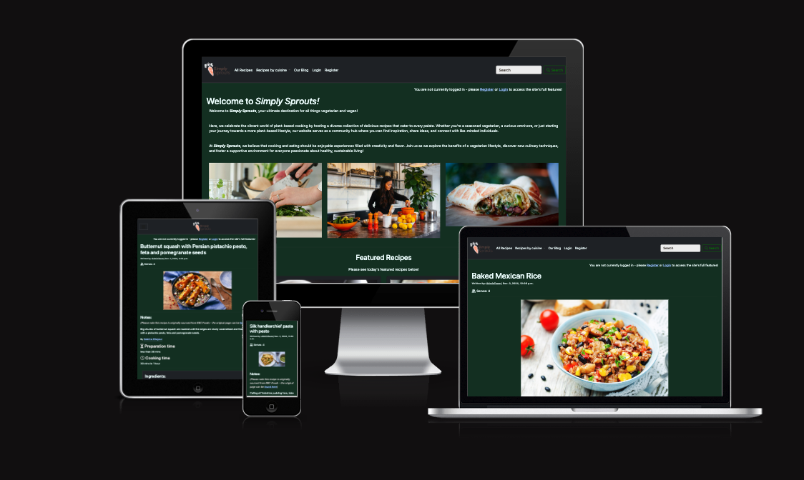
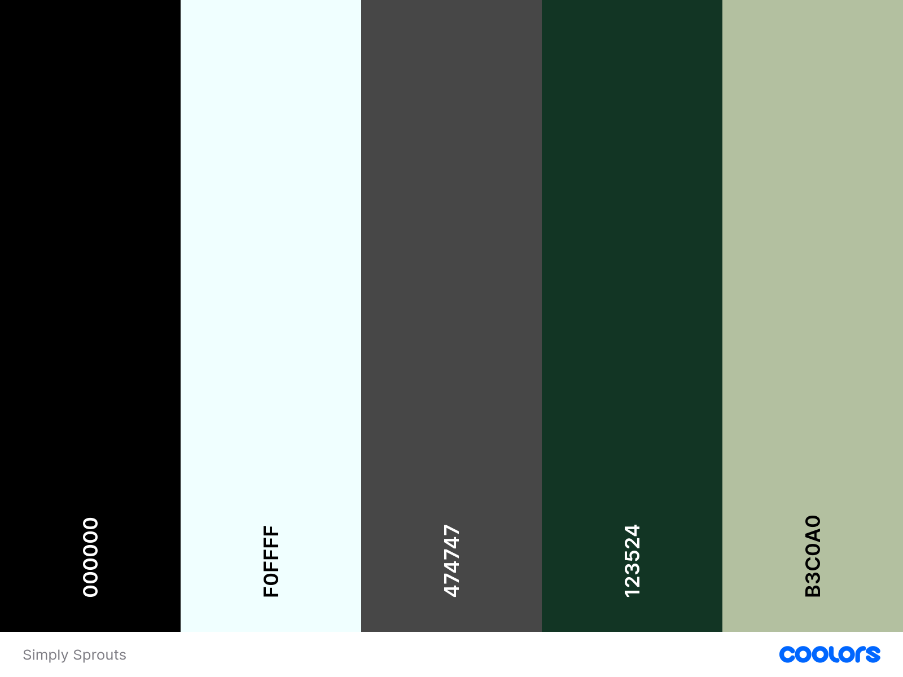
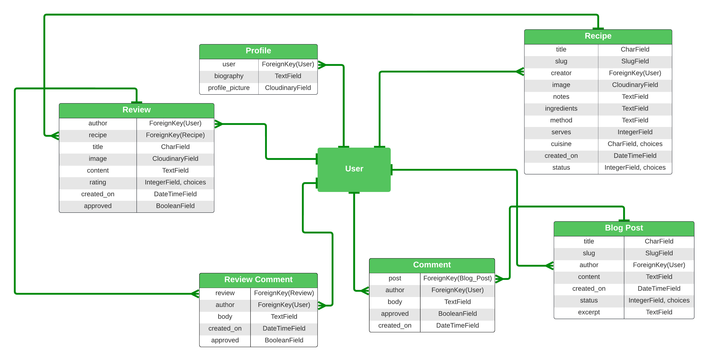
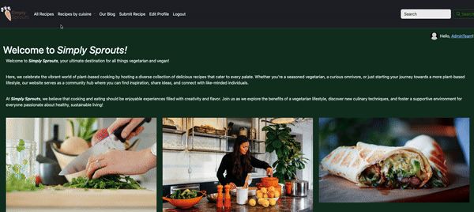
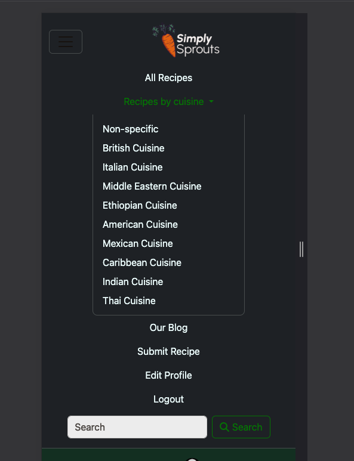
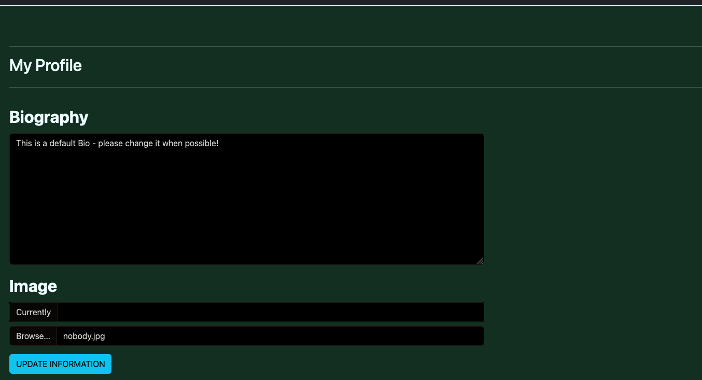
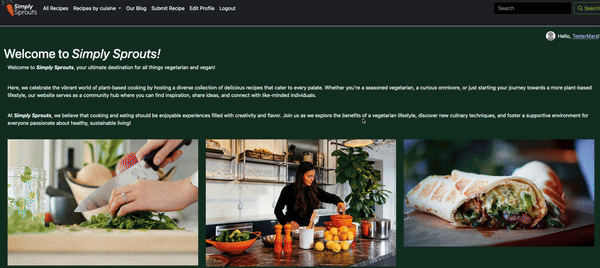
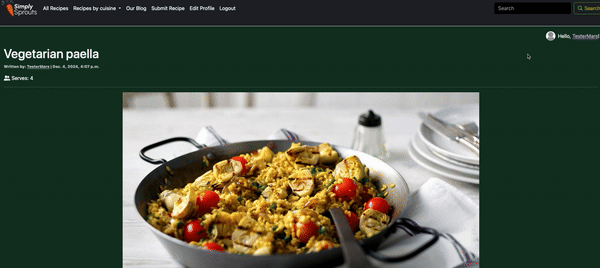

# **Simply Sprouts**

**Simply Sprouts** is an online platform designed to foster community and share information between members of the Vegetarian and Vegan culinary world.

It allows users to easily browse admin-created recipes, submit their own recipes in turn, review recipe to offer personal insight, share tips and feedback in Review comments, read admin-posted blogs and offer colleage feedback and commentary on fellow users' submissions.

It allows the site admins to easily create the recipes and blog posts for the users to browse through through the Admin Space, and offers moderation features on all user-submitted content. 

The project is my culmination of my time studying Code Institute's High Performance Full Stack Software Developer: Skills Bootcamp and is a focus on Python coding and the Django framework - with database manipulation and CRUD functionality being a main focus of all implemented functionality.

Live site can found here: <a href="https://simplysprouts-moakley-505a1d8688f8.herokuapp.com/" target="_blank">Simply Sprouts</a>

For **Admin access**, please click <a href="https://simplysprouts-moakley-505a1d8688f8.herokuapp.com/admin" target="_blank">here</a>.

A created user profile can be accessed using the details below:

User: Guest_User_Tour

Password: Guest!Tour!2024

To access the Github repository, click <a href="https://github.com/moakley-45/MO_Capstone" target="_blank">here</a>.

Project Board can be found here: <a href='https://github.com/users/moakley-45/projects/6' target="_blank">Simply Sprouts Project Board</a>

## Table of Contents
1. [Overview](#overview)
2. [UX - User Experience](#ux---user-experience)
    - [Design Inspiration](#design-inspiration)
    - [Colour Scheme](#colour-scheme)
    - [User Stories](#user-stories)
    - [Wireframes](#wireframes)
3. [Database Schema - ERD Diagram](#database-schema---entity-relationship-diagram)
4. [Security](#security)
5. [Build Process and Agile Management](#build)
5. [Features](#features)
    - [User View - Registered/Unregistered](#user-view---registeredunregistered)
    - [Role-Based Dashboard Features](#role-based-dashboard-features)
    - [Role-Based Navigation](#role-based-navigation)
    - [Soft Delete/Archiving for Patient Accounts](#soft-deletearchiving-for-patient-accounts)
    - [Appointment Booking System](#appointment-booking-system)
    - [Messaging System](#messaging-system)
    - [Profile Management](#profile-management)
    - [Confirmation Messages](#confirmation-messages)
    - [CRUD Functionality](#crud-functionality)
    - [Feature Showcase](#feature-showcase)
6. [Future Features](#future-features)
7. [Technologies & Languages Used](#technologies--languages-used)
8. [Libraries & Frameworks](#libraries--frameworks)
9. [Tools & Programs](#tools--programs)
10. [Testing](#testing)
    - [Validation Testing](#validation-testing)
    - [User Testing](#user-testing)
    - [Bugs](#bugs)
11. [Deployment](#deployment)
    - [Connecting to GitHub](#connecting-to-github)
    - [Django Project Setup](#django-project-setup)
    - [Cloudinary API](#cloudinary-api)
    - [PostgreSQL](#postgresql)
    - [Heroku deployment](#heroku-deployment)
12. [Credits](#credits)
    - [Code](#code)
    - [Media](#media)
13. [Acknowledgements](#acknowledgements)

## Overview
Simply Sprouts is an online platform that allows users to:
- Register and create a profile
- Search for ingredients or topics
- Read through Admin-created Recipes
- Read through Admin-created Blog Posts
- Comment on Admin-created Blog Posts and read/reply to other users' comments
- Submit their own recipes via a dedicated form
- Find randomised recipes immediately, via the Home Page
- Leave reviews to both user-submitted and Admin-created recipes, offering their insight with a star rating and uploaded images
- Comment on user-submitted reviews, to foster community and share insight. 

The platform ensures accessibility across all devices and browsers through Mobile-Frist design principles, and its goal is to maxmise the social side of recipe and food-preparation materials through user-submissions and user communication.

In future iterations, Simply Sprouts will add functionality for users to save and sort recipes into lists, submit user-submitted blog posts, and offer expanded functionality in recipes pages through improved Ingredient Lists and 'Shopping Lists' functionality.

## UX - User Experience

### Design Inspiration

In planning and creating the site, I performed an ad-hoc interview with some friends of mine, who run the gamut from skilled chefs to bashful novices, to see what they would look for in a recipe site.

Their answers were very informative - they expressed a preference for social interactions from users, user-submitted feedback and simplicity in site design, over highly-detailed but visually busy pages.

They expressed they often find such sites confusing and annoying to browse through, and often preferred to browse for recipes on social media services that focus on short-form video content, such as Tiktok or Instagram Reels, over choosing to look for a more traditional recipe formatted site. 

This information resulted in the following design choices:
- A focus on recipe filtering and pagniation on the site, to avoid create visually-overwhelming pages with hundreds of entries.
- A truncated and shortened content format for non-essential details, to better respect users' time and attention 
- If possible, a search feature to aid in navigation and make finding a desired recipe more immediate.
- Clear images at the start of the recipe which focus on the food itself, rather than influencer-heavy branding and marketing.
- Darker branding colors, to avoid eye-strain when reading finer details on a brightly-lit space.

In terms of my more personal choices, I also decided to try and fill the Recipe Page's horizontal space after reading through a lot of recipe sites for research and realising how many rely on hugely long recipes page that necessitate a huge scroll time or a nav-bar to make the scrolling managable. 

I found I came to prefer sites that either host recipes in a simple grid format, or offer a grid-table along with extensive copy that I could dutifully scroll past to get to the essential recipe information. 

Good examples of this design philosophy are below:

- [BBC Food](https://www.bbc.co.uk/food) 
- [Rainbow Plant Life](https://rainbowplantlife.com/)

### Colour Scheme

The site's main color is a subdued dark green, to reflect the vegan/vegetarian theme of the site and offer a soothing user experience for long periods of reading/scrolling. 
The site uses black, a mild grey tone and Azure (#f0ffff) for the main content space, after user-feedback that these made the user experience of reading through detailed instructions much more pleasant with the former white colors inverted to make reading easier for a user with vision issues. 

The full scheme can be seen below:

## Database Schema - ERD Diagram

The image of Simply Sprouts' full Entity Relationship Diagram can be found below - illustrating how the different models in the PostgreSQL database for the site's components connect to each other and their shared Foreign Keys.

The User model is the most-referrenced Foreign Key, appearing in most of the other models as the diagram demonstrates. 

## Security and User Access
All user data and data for user-submissions are securely handled with Django’s security features:
- CSRF protection is built into all form submissions.
- Sensitive information e.g passwords are protected using Django's built-in authentication.
- Admin authority to restricted to authorized users through the Admin space, and users cannot access Delete or Edit functionality for any user-submitted features they have not submitted personally. 

## Build Process and Agile Management

### Pre-planning

My goal in planning my project was to maximise use of time and minimalising any chance of crunch by getting to MVP state as quickly as possible.

After a thorough study of the Marking Criteria for the project, I decided that MVP state, in terms of this project, would mean the following:

- At least two working pages, to check successful navigation
- One model that offered CRUD status, by which I mean implementing at least one Model and View that allowed the user to create and read user-submitted content, edit as preferred and delete their submitted content freely.
- One custom created model, which also offered CRUD status. 

With numerous completions of the walkthrough _CodeStar Project_ from the LMS for the Bootcamp, I felt very confident to recreate a Blog-style Django project, so decided to make the Blog the focus of my first steps in creating Simply Sprouts, and gave myself a strict two-day window to complete this, so I could move onto my custom models as soon as possible to increate time for trouble-shooting and bug-fixing.

Thus, I made getting to MVP Status the main focus of Sprint 1 of building. My schedule for this work, with Agile Planning kept in mind, was the following:

- Sprint 1 - reach MVP status as quickly as possible - build a Blog project.
- Sprint 2 - Implement planned work on Recipe pages, to meet website business goal.
- Sprint 3 - Styling previous work and create Home app, to offer a detailed Home Page Model.
- Sprint 4 - Build a filtering system for created recipes, to offer expanded navigation options.
- Sprint 5 - Build a form to allow for user-submitted Recipes, and update filtering system to support this.
- Sprint 6 - Build a Search system and Randomiser feature, if time allows.
- Sprint 7 - Build Review and Review Comments feature and finalise work on Recipe Page state.

Given the time scale available for this project - three weeks of five working days, plus out-of-hours time if needed, I believed that the acceptable aim was to complete Sprints 1 through 4, with Sprints 5 and 6 only becoming focused on if time allowed.

I am happy to report I was able to complete all 7 planned Sprints successfully, so created a final sprint:

- Sprint 8 - Customise site with preferred styling elements and plan for future features.

This has also been completed.

### Build Process Journal

1. _The build process went well on Day one, with the Blog aspect of the site being built out quickly and being filled with dummy Lorem Ipsum content data, for testing. I implemented the same Comment model taught in the LMS, to achieve CRUd state as quickly as possible. I am unhappy with the Javascript Modal method used here, however, and will likely replace this with a slug-based template method at a further point._
2. _The Blog project is completed now, with prototype of the Comment model in place. The difficulty of styling the Bootstrap elements used however, has cemented my decision to move away from this choice in future design steps._
3. _Recipe Model is now created and implemented - the Model itself uses a Choice field, which I was glad to improves as it should allow for much easier filtering further down the line. I will consult with Kevin, our Subject Matter Expert, for further guidance on the best way to achieve this. Using the BBC Food Recipe archive as a source, I have created many recipe pages, to allow for better filtering when this is possible._
4. _I have created a Home app, to create a bespoke Home Page template and to house the User Profile. I have now successfully implemented this, but have run into a bug where new created Users are not automatically triggering a User Profile to be generated._
5. _I have resolved the previous bug and User Profiles are now working as intended. I have built out the filtering system following an online guide, and it is working in repeating testing. I am moving onto creating the User Recipe submission form._
6. _I have successfylly created the recipe form, but it is more basic than I'd prefer. I have replaced this with a Cripsy Form, and added Summernote Content fields, to allow for more formatting options for users when working through the form. I have also moved back to the Filtering system, amending this to offer the option to sort through User-submitted Recipes as well, along with better navigation options following Kevin's feedback and guidance, in our previous session._
7. _I have started work on a Search system, to allow for more detailed navigation. I have encounted a small bug where Blog pages are not included as part of the Search results. I have been able to resolve the previous bug now, and the Search results display both Blog and Recipe results._
8. _The content on the Recipe Submit form is currently too small on Mobile Screens. I have added a warning message and hidden the content on screens this size, and made other changes to the SummerNote integration to make this more workable on smaller screens and break-points._ 
9. _I have started work on the Recipe model and View, to update the Recipe Page template. I have added the Review fully and added some Javascript to update the Rating field's styling into full stars, for an improved UI and more immediate visibility._
10. _The Review Comment model has been fully implemented now, and testing has proved that the Comments are correctly loading in the Admin space for moderators' approval when submitted. The recipe page is now finalised._
11. _I have added a randomiser on the Home Page temmplate, to further flesh out the content here and offer an more-immediate and visble way to access the Recipes._ 

## Features

### _Implimented Features_

### Universal Features

- Navigation

Users can sort by Recipe, or easily navigate through all pages. The Nav Bar is also hidden by a toggle on Smaller Screens, to maximise screen space:

### Profile Page Features

- User input

Users can add a Biography to make the page feel customised and select a Profile Picture, which can be replaced any time by visiting this page:

### Home Page Features

- Randomiser

Users are presented with two recipes, which are randomly generated whenever the page is visited or reloaded, to offer immediate access to the recipe content:

### Recipe Features

- Recipe information

The user can easily see all the information presented for each recipe, with clear content areas:

- Review

The user can submit a Review of the Recipe in question; leaving their thoughts, a star rating and image:

- Review comments

### Blog Features

### Search Features

- Search function

Users can search for terms and get results from both the Recipe and Blog models:

### _Future Features_

In a future development round, I would aim to implement the following features:

- **Comments/ Reviews / Review Comments** - update the styling to reference the user's Profile Picture for greater social effect.
- **Profile Page** - add the option to create a Recipe Book of saved recipes and a shopping list of ingredients based on selected Recipes
- **Recipe Pages** - update the page with a Tips section and rebuild the Notes Section to have more exhaustive features.
- **Recipe Pages** - update the page to offer Video footage, to support Tik/ Instagram Reel integration if desirable.
- **Comments/ Reviews / Review Comments** - update the comments interface to have UpVotes/DownVotes feature, to increase social interaction.

## Technologies & Languages Used

- HTML5 - Markup language for the website's structure and for tagging design aspects
- CSS3 - Styling language, for the website's aesthetic and for custom styling elements
- Bootstrap - To simplify much of the website's structual composition and base styling
- JavaScript - For DOM manipulation and event listeners to trigger interactive functionalities
- Python (Django) - Backend web framework for server-side logic and management
- PostgreSQL - Database management system for storing data
- Cloudinary - Cloud-based image storage solution
- Summernote - To offer WYSIWYG editors, for expanded content creation possibilites
- Whitenoise - For serving static files directly from Django to the site's front end.

## Tools & Programs

- Bootstrap - Frontend framework
- Django - Backend framework
- Django Crispy Forms - For elegant form rendering
- Summernote - For WYSIWYG editor integration
- Cloudinary - Storage and Content delievery of image files
- Whitenoise - For serving static files

## Testing

## User Testing

## Deployment

This project was coded in Gitpod, a IDE maintained by the Code Institute Team based on Visual Studio. My linked code repo is staged on GitHub, with Git being used for version control, and the application was deployed to Heroku

The steps taken to deploy the site on to Heroku are as follows:

1. Create New App: Log in to your Heroku account and click on the "Create New App" button.
2. App Name: Choose a unique name for your app.
3. Select Region: Choose the appropriate region (Europe was selected for this project).
4. Create App: Click the "Create App" button to proceed.
5. Deployment Method: In the "Deploy" tab, select GitHub as the deployment method.
6. Connect to GitHub: Search for the repository name and click "Connect".
7. Manual or Automatic Deployment: Select either manual or automatic deployment. Ensure the main branch is selected for deployment.
8. Config Vars: In the "Settings" tab, click "Reveal Config Vars" and input the required environment variables.
9. Buildpack: Select Node.js and Python as the buildpacks for your project.
10. Deploy: Once the configuration is complete, click the "Deploy Branch" button. After successful deployment, a "View" button will appear to take you to the live site.

## Credits & Acknowlegments 